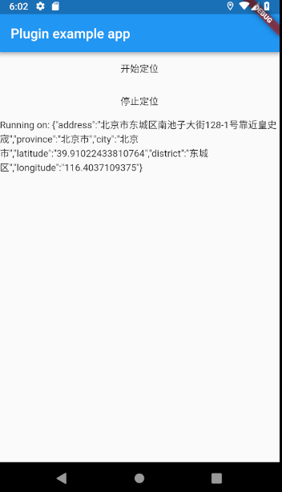

# Amap Location Plugin

[](https://pub.dartlang.org/packages/amap_location_plugin)


A Flutter plugin to access location information with AMap Location SDK.

This plugin now is only developed for Android platform, so it only inplements the android amap sdk.
which provides the function with location infomation for flutter app in android platform in china.

According to the usage description below, developer can get the location infomation easily.



## Usage
To use this plugin, add `amap_location_plugin` as a [dependency in your pubspec.yaml file](https://flutter.io/platform-plugins/).

### 1.依赖高德地图定位sdk
在app的build.gradle文件里加入

``` 
dependencies {
    implementation 'com.amap.api:location:latest.integration'
}
```

在flutter的pubspec.yaml文件里添加

```
dependencies:
  flutter:
    sdk: flutter

  ...
  amap_location_plugin: ^0.1.1
```

### 2.申请key
根据[高德官方文档](https://lbs.amap.com/api/android-location-sdk/guide/create-project/get-key)申请高德sdk的key

### 3.配置AndroidManifest.xml
在AndroidManifest.xml的application标签中配置Key：

```xml
<meta-data android:name="com.amap.api.v2.apikey" android:value="您的Key">
</meta-data>
```

在application标签中声明service组件：

```xml
<service android:name="com.amap.api.location.APSService"></service>
```
在AndroidManifest.xml中按需配置权限:

```xml
<!--用于进行网络定位-->
<uses-permission android:name="android.permission.ACCESS_COARSE_LOCATION"></uses-permission>
<!--用于访问GPS定位-->
<uses-permission android:name="android.permission.ACCESS_FINE_LOCATION"></uses-permission>
<!--获取运营商信息，用于支持提供运营商信息相关的接口-->
<uses-permission android:name="android.permission.ACCESS_NETWORK_STATE"></uses-permission>
<!--用于访问wifi网络信息，wifi信息会用于进行网络定位-->
<uses-permission android:name="android.permission.ACCESS_WIFI_STATE"></uses-permission>
<!--这个权限用于获取wifi的获取权限，wifi信息会用来进行网络定位-->
<uses-permission android:name="android.permission.CHANGE_WIFI_STATE"></uses-permission>
<!--用于访问网络，网络定位需要上网-->
<uses-permission android:name="android.permission.INTERNET"></uses-permission>
<!--用于读取手机当前的状态-->
<uses-permission android:name="android.permission.READ_PHONE_STATE"></uses-permission>
<!--写入扩展存储，向扩展卡写入数据，用于写入缓存定位数据-->
<uses-permission android:name="android.permission.WRITE_EXTERNAL_STORAGE"></uses-permission>
<!--用于申请调用A-GPS模块-->
<uses-permission android:name="android.permission.ACCESS_LOCATION_EXTRA_COMMANDS"></uses-permission>
<!--用于申请获取蓝牙信息进行室内定位-->
<uses-permission android:name="android.permission.BLUETOOTH"></uses-permission>
<uses-permission android:name="android.permission.BLUETOOTH_ADMIN"></uses-permission>
```

### Example

``` dart
// Import package
import 'package:amap_location/amap_location_plugin.dart';

// Instantiate it
AmapLocation _amapLocation = AmapLocation();

//start location
_amapLocation.startLocation;

//stop location
_amapLocation.stopLocation;

// Access current location
print(_amapLocation.getLocation);

// Be informed when the state (full, charging, discharging) changes
_amapLocation.onLocationChanged.listen((String location) {
  // Do something with new state
});
```

